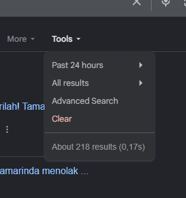
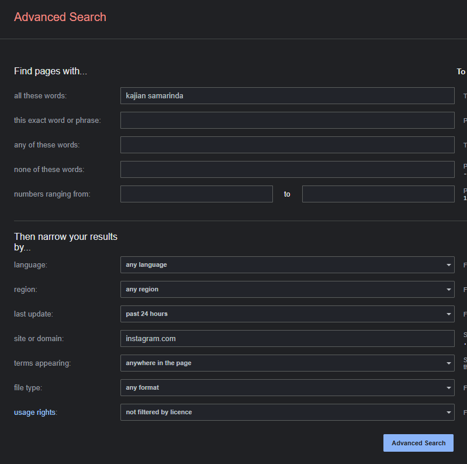
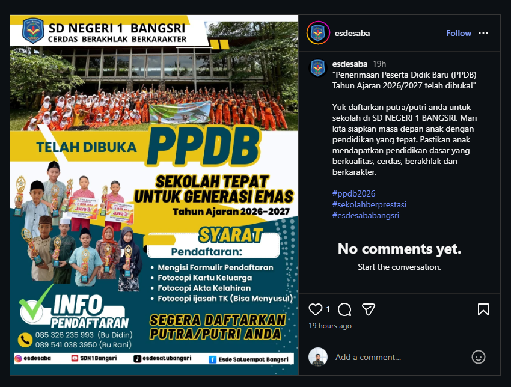

# Landing Page

## Mencari Target

- Buka Google
- Pilih Advanced Search:

  

  

  Yang perlu diperhatikan:
  - all these words
  - last update (pilih : past 24 hours)
  - site or domain (pilih : instagram.com)

  Kemudian klik `Advanced Search`

- Untuk `all these words`, itu pilihannya adalah:

  ```
  kajian + nama kota
  seminar + kota
  workshop + kota
  open house sekolah
  PPDB
  tabligh akbar
  ```

- Pilih salah satu event, klik. Contohnya aja aku menemukan ini:

  

## Membuat Website Contoh

- Buka VS Code. Kalau belum ada, download dulu (cari di Google dengan kata kunci : Download VS Code)
- Buatlah project baru
- Buatkan file `QWEN.md` yang isinya adalah:

  ```markdown
  - Tampilan mobile only. Kalau dibuka di laptop, maka max width 500px
  ```

- Buatkan file `perintah.txt` yang isinya contonya adalah seperti ini:

  ```
  Buat website landing page untuk acara berikut:

  Nama acara: Penerimaan Peserta Didik Baru (PPDB) SD Negeri 1 Bangsri
  Tema: Sekolah tepat untuk generasi emas
  Target peserta: Calon wali santri
  Motto sekolah: Cerdas Berakhlak Berkarakter
  Syarat pendaftaran: Mengisi formulir pendaftaran, fotocopy kartu keluarga, fotocopy akta kelahiran, fotocopy ijasah TK (bisa menyusul)
  PIC: 085 326 235 993 (Bu Didin), 089 541 038 3950 (Bu Rani)
  Media Sosial:
  - Instagram : esdesaba
  - YouTube : SDN 1 Bangsri
  - TikTok : esdesatubangsri
  - Facebook : Esde Satuempat Bangsri

  Struktur:
  - headline kuat
  - subheadline
  - deskripsi acara
  - manfaat ikut
  - profil pembicara
  - CTA daftar

  Tone: profesional + persuasif.
  ```

  Untuk templatenya itu, ini:

  ```
  Buat website landing page untuk acara berikut:

  Nama acara:
  Tema:
  Target peserta:
  Tanggal:
  Lokasi:
  Pembicara:
  Tujuan acara:

  Struktur:
  - headline kuat
  - subheadline
  - deskripsi acara
  - manfaat ikut
  - profil pembicara
  - CTA daftar

  Tone: profesional + persuasif.
  ```

- Buka Terminal, lalu ketikkan `qwen`
- Ketik: @perintah.txt
- Tinggal tunggu aja website dibuatkan
- Kalau sudah, upload ke hosting. Contohnya: https://bangsri.zonabelajar.my.id/

## Menawarkan

- Untuk menawarkan, kita bisa DM dengan template seperti ini:

  ```
  Assalamu’alaikum, saya lihat ada acara [nama event].
  Biasanya peserta banyak tanya detail di chat ya, jadi sering repot jawab satu-satu.

  Saya biasa bantu panitia buat landing page 1 halaman berisi info acara + pendaftaran supaya rapi dan mudah dibagikan.

  Ini saya sudah buatkan contoh websitenya khusus untuk konsep acara seperti ini:
  [link contoh]

  Kalau cocok, saya bisa buatkan versi resminya. Biayanya Rp250 ribu saja. 🙏
  ```

  Contohnya:

  ```
  Assalamu’alaikum, saya lihat ada acara PPDB SD Negeri 1 Bangsri.
  Biasanya calon wali siswa banyak tanya detail di chat ya, jadi sering repot jawab satu-satu.

  Saya biasa bantu panitia buat landing page 1 halaman berisi info acara + pendaftaran supaya rapi dan mudah dibagikan.

  Ini saya sudah buatkan contoh websitenya khusus untuk konsep acara seperti ini:
  https://bangsri.zonabelajar.my.id/

  Kalau cocok, saya bisa buatkan versi resminya. Biayanya Rp250 ribu saja. 🙏
  ```

## Supaya Mencapai 300 Ribu Rupiah per Hari

- Untuk mencapai target 300 ribu rupiah per hari, berarti harus memperbanyak peluangnya
- Kalau bisa, setiap hari, DM 50 akun dengan cara seperti di atas
